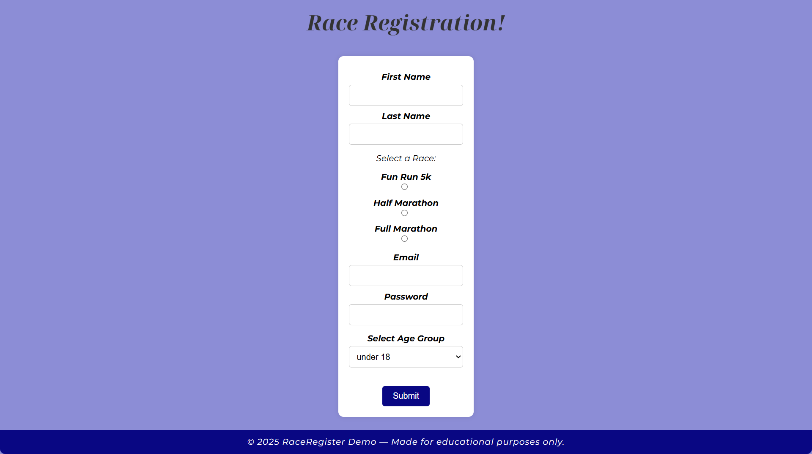

# RaceRegister

A sleek and responsive race registration form built with HTML and CSS. Users can select race types, provide personal information, and choose an age group — all within a clean, accessible layout.

> ⚠️ **Note:** This is a demo project and not intended for actual race registration.

---

## ✨ Features

- **Responsive Design** – Clean layout that adapts to all screen sizes
- **Form Validation** – Basic client-side checks for required fields and input lengths
- **Race Type Selection** – Choose between Fun Run 5K, Half Marathon, and Full Marathon
- **Age Group Dropdown** – Select from predefined age groups

---

## 🛠️ Tech Stack

- **HTML5** - Structure of the form.
- **CSS3** - Styling, layout and responsiveness.
- **Google Fonts** - For clean, modern typography

---

## 📸 Screenshot

### 🌟 Project Overview

---

## 🚀 Getting Started

1. Clone the repository to your local machine.
2. Open `race_registeration_form.html` in your web browser to view and interact with the form.

---

## 🤝 Contributing

Contributions are welcome! If you'd like to enhance the design or add new features, feel free to:

1. Fork the repo

2. Create a new branch

3. Make your changes

4. Open a Pull Request with a clear description

Please follow consistent styling and commit message conventions.

---

## 🤍 Credits

- [Google Fonts](https://fonts.google.com/) for font resources.
- Inspired by various online form design tutorials and resources.

---

## 📄 License

This project is licensed under the MIT License. See the [LICENSE](LICENSE) file for more details.
